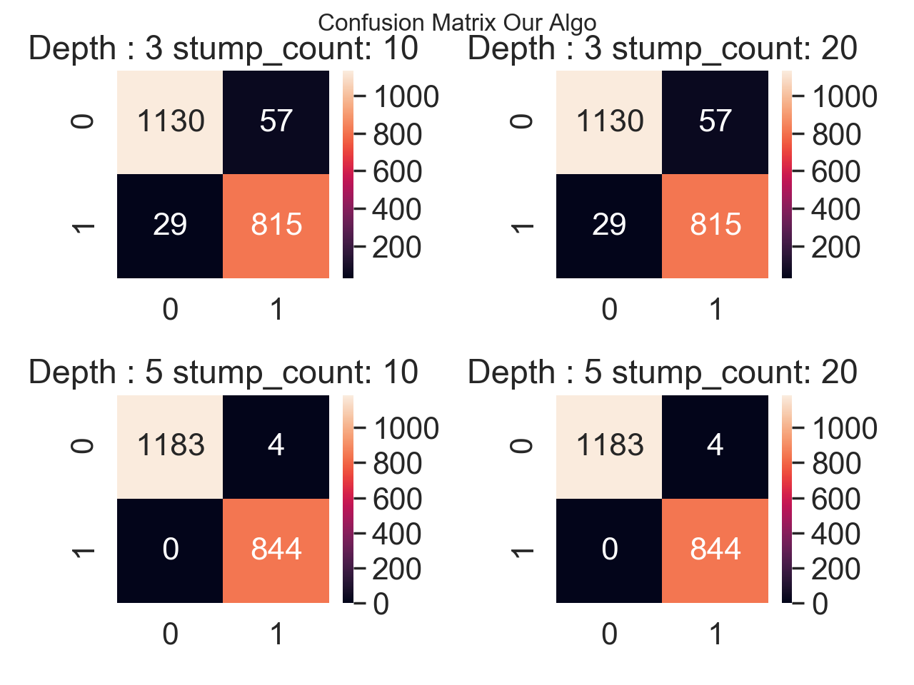
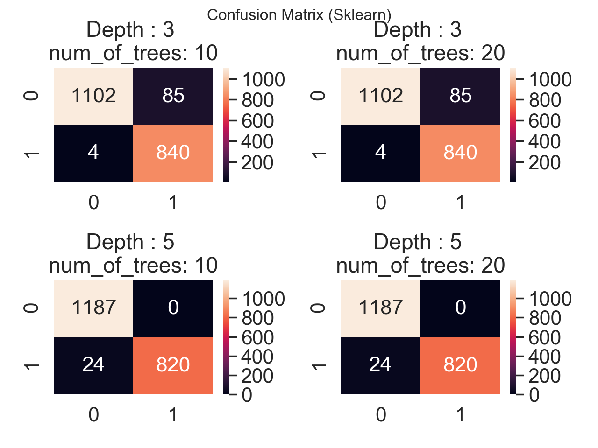
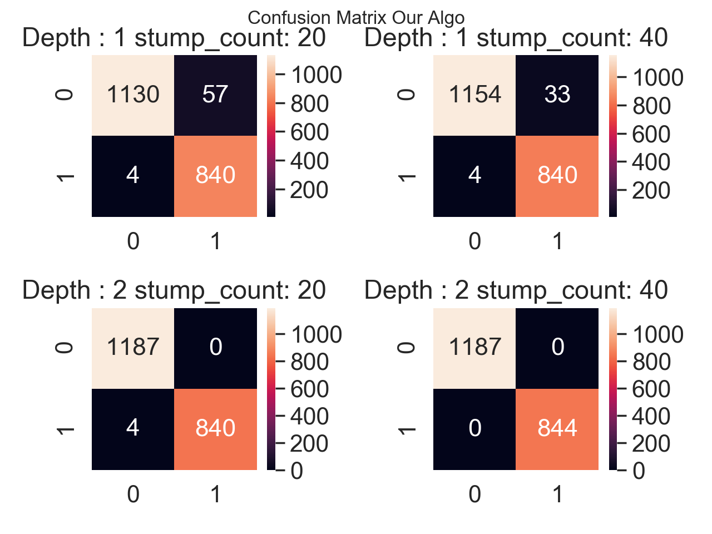
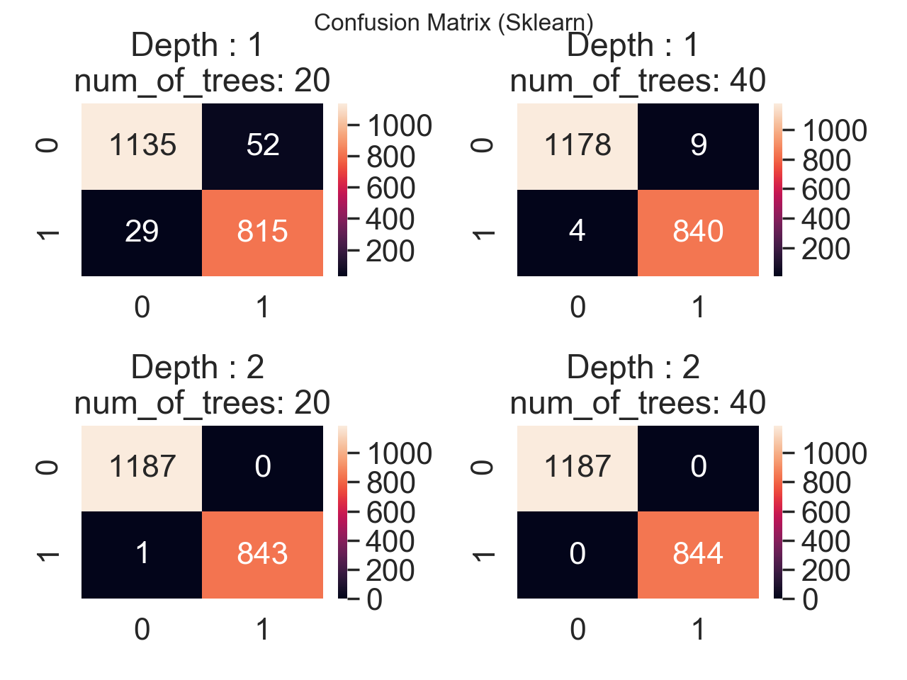

# Ensemble-Methods-Python
Bagging and Boosting implementation (along with ID3 Decision tree) in pure Python.

Comparison made with SciKit Learn's algorithms.

## BAGGING

    

    

## BOOSTING (ADABOOST)

    

    

